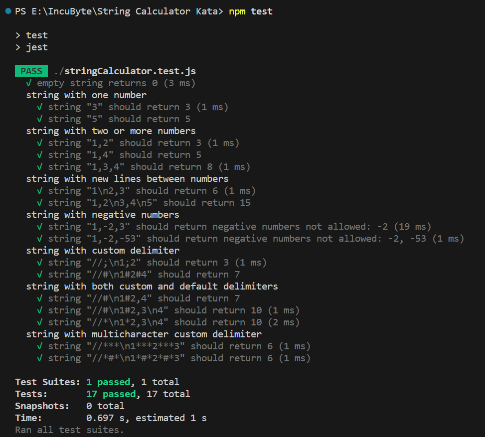

# 📟 String Calculator Kata

This project is a test-driven development (TDD) implementation of the **String Calculator Kata**. The goal of this kata is to incrementally build a string-based calculator by writing tests first, then implementing features to make those tests pass.

---

## 📁 Project Structure

```
String-Calculator-Kata/
├── stringCalculator.js 
├── stringCalculator.test.js        
├── README.md
├── package.lock.json
└── package.json
```

---

## 🛠️ Technologies Used

- Language: JavaScript
- Testing Framework: Jest

---

## 🚀 Getting Started

### Clone the Repository
```bash
git clone https://github.com/Prashant-021/String-Calculator-Kata.git
cd String-Calculator-Kata
```

### Install Dependencies (If using JavaScript)
```bash
npm install
```

### Run Tests
```bash
npm test
```

---

## 📌 Features Implemented

- Returns `0` for empty strings
- Returns the number for single input
- Sums comma-separated numbers
- Supports newlines as delimiters
- Supports custom delimiters like `//;
1;2`
- Throws error for negative numbers
- Supports delimiters of any length (`//[***]
1***2***3`)

---

## 🧪 Sample Usage

```js
add("")               // ➞ 0
add("1")              // ➞ 1
add("1,2")            // ➞ 3
add("1\n2,3")         // ➞ 6
add("//;\n1;2")       // ➞ 3
add("//***\n1***2")   // ➞ 3
```

---

## ⚠️ Error Handling

- **Negative Numbers:** Throws an exception listing all negative values  
  Example:
  ```bash
  Error: Negatives not allowed: -1, -4
  ```

---

## 📸 Screenshots

> You can add screenshots by uploading them to the repo and referencing them like this:

```markdown

```

---

## 📚 Learning Objectives

- Practice TDD principles
- Write modular, testable code
- Refactor confidently with test coverage
- Handle edge cases and string parsing

---

## 📄 License

This project is open source and available under the [MIT License](LICENSE).

---

## 🙌 Acknowledgments

Based on the original kata by [Roy Osherove](https://osherove.com/tdd-kata-1).
